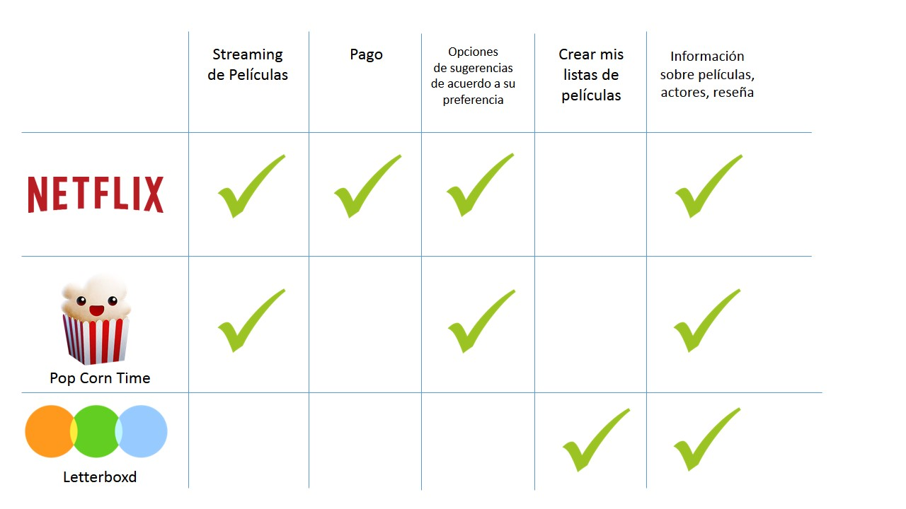

# MOVIETIME

El proyecto consiste en la creción de una comunidad social que permite a los usuarios crear y compartir con sus amigos reseñas y listas personalizadas de las peliculas que han visto.

## Desarrollado para 
[Laboratoria](http://laboratoria.la)

## OBJETIVO DEL PROYECTO
Reducir el tiempo de los usuarios al momento de buscar información y brindarles un sitio de navegación sencilla y entretenida.

### PLAN PROPUESTO DE INVESTIGACIÓN
#### Objetivo de la investigación:
Conocer las principales necesidades y hábito de los usuarios al momento de elegir una película y como se relacionan entre ellos.

Público Objetivo:
- Jóvenes  entre 18 y 37 años.

#### Business Model Canvas
https://canvanizer.com/canvas/wz0SToq3SCOGY

#### HERRAMIENTAS
- Benchmarking
- Encuestas
- Entrevistas a profundidad
- Diagrama de afinidad
- Testing

## ETAPAS
### 1. INVESTIGACIÓN

#### Benchmarking

#### Entrevistas

Se realizaron entrevistas a profundidad a 7 personas para poder recabar sus hábitos y preferencias al momento de ver una película. Los principales datos que encontramos fueron los siguientes:

- Utilizan Netflix para ver películas.
- No se cambiarían de servicio (Netflix), a no ser que el nuevo que adquieren les brinde muchos más beneficios y un menor precio.
- Prefieren ver videos cuando  estan en casa, pero también los miran cuando estan en el transporte público.
- Utilizan diferentes apps sociales en su celular.
- Al momento de elegir que película la mayoría recurre a internet para buscar recomendaciones.
- Algunas preguntan a amigos por recomendaciones.

#### Encuestas

### 2. SINTESIS E IDEACIÓN

#### Diagrama de Afinidad

Se realizó un diagrama de Afinidad con la finalidad de poder analizar los datos obtenidos de las encuestas y entrevistas y agruparlos de acuerdo a las similutes de las respuestas. Los temas encontrados fueron :

https://realtimeboard.com/app/board/o9J_kzs5iMw=/

**CONCEPTUALIZACIÓN**

En base a la información recabada decidimos enfocarnos en los siguientes beneficios para los usuarios:
- Crear listas personalizadas de sus películas
- Escribir reseñas e acceder a información de películas
- Compartir esa información con sus amigos
- Agregar a sus amigos y compartir sus actividades por redes sociales(FB, twitter)
- Sugerencias de películas basadas en su preferencia/historial

#### User Persona

https://app.xtensio.com/folio/ay2soxd5

### 3. PROTOTIPADO Y TESTING

#### PAPER PROTOTYPING
Los primeros testing se realizaron en papel y el feedback que obtuvimos fue el siguiente:

- Pensaron que se trataba de una página para ver películas online.
- Les agrado la opción de poder compartir sus reseñas y listas con sus amigos.
- Sugirieron otro orden para los iconos de puntuación, ver más tarde y favoritos dentro de una películas especifica.
- Les parecio sencillo de usar.
- Confusión entre la sección de reseñas y listas.
- Querían agregar más opciones a la sección de Mi cuenta.

#### ALTA FIFELIDAD
Se priorizo el MPV, y se realizaron lo flujos de "Ingreso a cuenta", "Añadir reseña", "Crear Lista"

- Le gustaron los colores
- Querían ver mas interacción
- Les gustaron los colores
- Les gustaría que haya una sección de trivia o noticias relacionadas al cine.

Link de marvel: https://marvelapp.com/14gh85fg/screen/40091260

